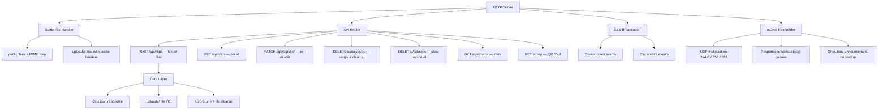
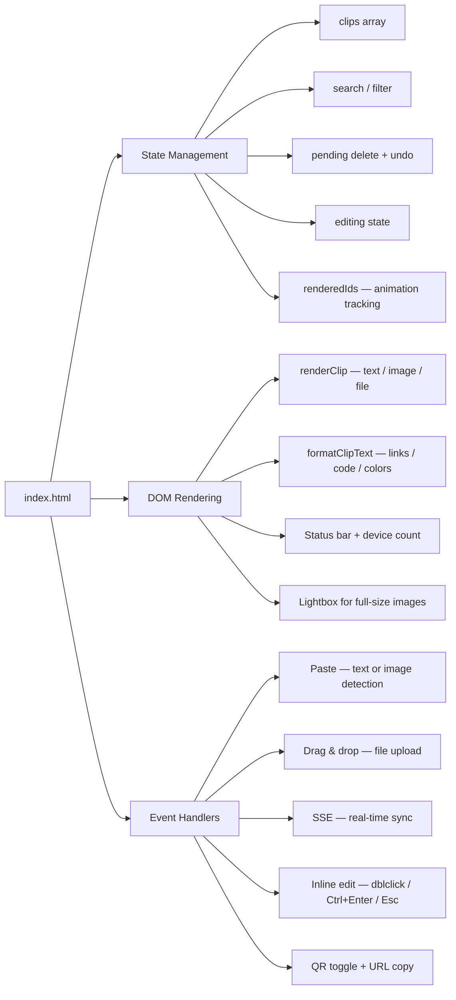
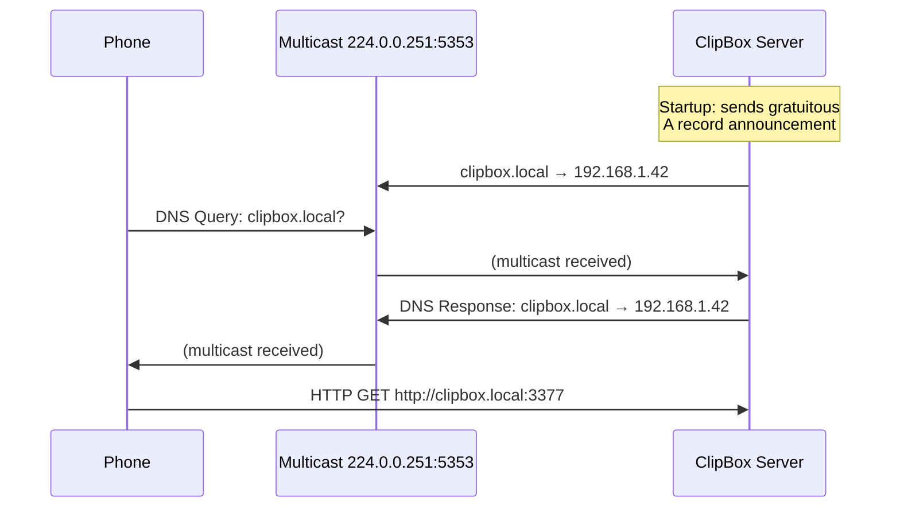
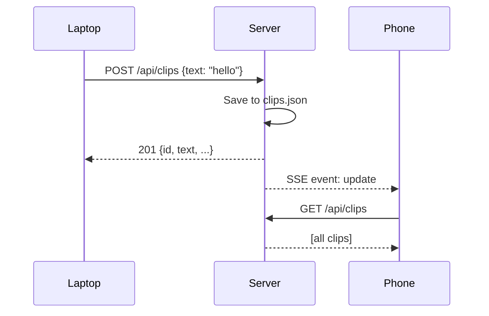

<p align="center">
  
</p>

<h1 align="center">C L I P B O X</h1>

<p align="center">
  <strong>Cross-device clipboard for your local network.</strong><br/>
  Paste text, screenshots, or files on one device — grab them from another.<br/>
  Zero dependencies. Zero accounts. Zero config.
</p>

<p align="center">
  
  
  
  
</p>

<br/>

<p align="center">
  
</p>

---

## Why ClipBox?

You screenshot something on your laptop. You need it on your phone. You paste a code snippet at work. You want it at home. You drag a PDF from your desktop. You need to download it on your tablet.

ClipBox is the fastest path between any two devices on the same network. No cloud. No login. No install. Just `node server.js`.

---

## Quick Start

### Node.js

```bash
git clone https://github.com/JoaquinSantarcangelo/clipbox.git
cd clipbox
node server.js
```

### Docker Compose

```bash
git clone https://github.com/JoaquinSantarcangelo/clipbox.git
cd clipbox
docker compose up -d
```

### Docker (standalone)

```bash
git clone https://github.com/JoaquinSantarcangelo/clipbox.git
cd clipbox
docker build -t clipbox .
docker run -d --network host -v clipbox-data:/app/data --name clipbox clipbox
```

After starting, the terminal prints:

```
  ┌──────────────────────────────────────────┐
  │             C L I P B O X                │
  ├──────────────────────────────────────────┤
  │  Local:   http://localhost:3377          │
  │  Network: http://192.168.1.42:3377      │
  │  LAN:     http://clipbox.local:3377     │
  └──────────────────────────────────────────┘

  Any device on this network can open http://clipbox.local:3377
```

Open **http://clipbox.local:3377** on any device connected to the same WiFi — or tap **QR** in the header and scan with your phone.

---

## Features

### Core

| Feature | Description |
|---------|-------------|
| **Real-time sync** | SSE pushes every change to all connected devices instantly |
| **Image transfer** | Paste a screenshot or photo — it appears on all devices with inline thumbnail |
| **File transfer** | Drag & drop or upload any file up to 10MB — download it from any device |
| **Text clips** | Paste or type text — auto-saved, searchable, with code block detection |
| **Inline edit** | Double-click any text clip to edit in place |
| **Pin clips** | Pin important items to keep them at the top across sessions |
| **Search** | Instant filtering across text content and filenames |
| **Undo delete** | 3-second undo window after deleting any clip |

### UX

| Feature | Description |
|---------|-------------|
| **QR Quick Connect** | Server-generated QR code SVG — scan to connect from mobile in 1 second |
| **mDNS discovery** | Reachable at `clipbox.local` — no IP to remember |
| **Dark / Light mode** | Toggle in the header, persisted in localStorage |
| **Paste-and-go** | Pasting into an empty input auto-saves the clip |
| **Duplicate detection** | Re-pasting the same text moves it to the top instead of creating a duplicate |
| **Image lightbox** | Click any image thumbnail to view full-size with backdrop blur |
| **Color swatches** | `#hex` and `rgb()` values render an inline color preview dot |
| **URL enrichment** | Links are auto-detected with a subtle domain label |
| **Code blocks** | Triple-backtick fences render as styled code blocks |
| **PWA installable** | Add to home screen on mobile for a standalone app experience |

### Technical

| Feature | Description |
|---------|-------------|
| **Zero dependencies** | Only Node.js built-in modules — no `node_modules`, no `npm install` |
| **Docker ready** | `Dockerfile` + `docker-compose.yml` included for one-command deployment |
| **Single-file SPA** | The entire frontend is one HTML file — CSS, JS, markup |
| **mDNS responder** | Built-in local network broadcast via `dgram` (zero-dep, best-effort) |
| **Persistent storage** | Clips in `data/clips.json`, files in `data/uploads/` |
| **Auto-prune** | Oldest unpinned clips are automatically removed when exceeding 100 clips |
| **File cleanup** | Physical files are deleted when their clip is deleted, pruned, or cleared |
| **Directory traversal protection** | Static file serving validates paths against the public root |
| **CORS enabled** | All API endpoints return `Access-Control-Allow-Origin: *` |

---

## Architecture

```
clipbox/
├── server.js              # HTTP server, API, SSE, QR encoder, mDNS, file I/O
├── public/
│   ├── index.html         # Single-file SPA (HTML + CSS + JS)
│   └── manifest.json      # PWA manifest for home screen install
├── Dockerfile             # Alpine-based Node.js container
├── docker-compose.yml     # One-command deployment with host networking
├── .dockerignore          # Keeps image clean (excludes data/, .git/, docs/)
├── data/                  # Auto-created at startup
│   ├── clips.json         # Persisted clip metadata (JSON array)
│   └── uploads/           # Uploaded files stored by clip ID + extension
├── docs/
│   └── screenshot.png     # Project screenshot
├── package.json
└── README.md
```

### Server Module Map



### Frontend Architecture



---

## API Reference

### Endpoints Overview

| Method | Endpoint | Description |
|--------|----------|-------------|
| `GET` | `/api/clips` | List all clips (newest first) |
| `POST` | `/api/clips` | Create text clip or upload file |
| `PATCH` | `/api/clips/:id` | Toggle pin (no body) or edit text (`{ text }`) |
| `DELETE` | `/api/clips/:id` | Delete single clip + cleanup file |
| `DELETE` | `/api/clips` | Clear all unpinned clips |
| `GET` | `/api/events` | SSE stream for real-time sync |
| `GET` | `/api/status` | Server stats (devices, clips, storage) |
| `GET` | `/api/qr` | QR code SVG for the network URL |
| `GET` | `/uploads/:filename` | Serve uploaded file with correct MIME |

### `POST /api/clips`

Create a new clip. Accepts either text or file payloads.

**Text clip:**

```bash
curl -X POST http://localhost:3377/api/clips \
  -H "Content-Type: application/json" \
  -d '{"text": "Hello from curl"}'
```

**File upload (base64):**

```bash
curl -X POST http://localhost:3377/api/clips \
  -H "Content-Type: application/json" \
  -d '{
    "file": {
      "data": "<base64-encoded-content>",
      "name": "screenshot.png",
      "mime": "image/png"
    }
  }'
```

| Status | Condition |
|--------|-----------|
| `201` | Clip created successfully |
| `200` | Duplicate text detected — moved to top (`{ ...clip, duplicate: true }`) |
| `400` | Missing text, file too large (>10MB), or body too large (>15MB) |

### `PATCH /api/clips/:id`

Toggle pin (no body) or edit text (with body).

```bash
# Toggle pin
curl -X PATCH http://localhost:3377/api/clips/m4x7k2ab

# Edit text
curl -X PATCH http://localhost:3377/api/clips/m4x7k2ab \
  -H "Content-Type: application/json" \
  -d '{"text": "Updated content"}'
```

### `DELETE /api/clips/:id`

Delete a single clip. Returns the deleted clip for potential undo operations. If the clip has an uploaded file, the physical file is deleted from disk.

```json
{ "ok": true, "clip": { "id": "m4x7k2ab", "type": "text", "text": "..." } }
```

### `DELETE /api/clips`

Clear all unpinned clips. Pinned clips are preserved. All associated files are cleaned up.

```json
{ "ok": true, "removed": 5 }
```

### `GET /api/events`

Server-Sent Events stream for real-time sync.

| Event | Payload | Trigger |
|-------|---------|---------|
| `update` | `{ action: "add" \| "delete" \| "patch" \| "clear" \| "duplicate", ... }` | Any clip mutation |
| `devices` | `{ count: number }` | Client connects/disconnects |

### `GET /api/status`

```json
{ "devices": 2, "clipCount": 15, "storageBytes": 142857 }
```

### `GET /api/qr`

Returns an SVG image encoding the server's network URL as a QR code. Zero-dependency encoder with Reed-Solomon error correction, versions 1–7.

### `GET /uploads/:filename`

Serves uploaded files with correct `Content-Type` headers and 24-hour cache (`Cache-Control: public, max-age=86400`).

---

## Data Schema

### Clip Object

```typescript
interface Clip {
  id: string;                  // Base36 timestamp + random suffix
  type: 'text' | 'image' | 'file';
  text?: string;               // Present for type: 'text'
  file?: {
    name: string;              // Original filename
    size: number;              // Size in bytes
    mime: string;              // MIME type (e.g., 'image/png')
    stored: string;            // Filename on disk: {clipId}.{ext}
  };
  pinned: boolean;
  createdAt: number;           // Unix timestamp in milliseconds
}
```

### Storage Layout

```
data/
├── clips.json                 # JSON array of Clip objects (pretty-printed)
└── uploads/
    ├── m4x7k2ab.png           # Image — stored by clip ID + original extension
    ├── m4x8b3cd.pdf           # File
    └── m4x9d4ef.jpg           # Image
```

---

## Configuration

All configuration is via environment variables or constants at the top of `server.js`:

| Variable | Default | Description |
|----------|---------|-------------|
| `PORT` | `3377` | HTTP server port |
| `MDNS_HOST` | `clipbox` | mDNS hostname — resolves as `{value}.local` |
| `MAX_CLIPS` | `100` | Maximum clips before auto-pruning oldest unpinned |
| `MAX_FILE_BYTES` | `10 MB` | Maximum file size per upload |
| `MAX_BODY_BYTES` | `15 MB` | Maximum request body size (base64 overhead) |
| `DATA_DIR` | `./data` | Persistent storage directory |

```bash
PORT=8080 MDNS_HOST=mybox node server.js
```

---

## Docker

### Quick Start

```bash
docker compose up -d
```

Builds the image from `Dockerfile`, starts with host networking (for mDNS), and mounts a named volume for persistent data.

### Manual Build

```bash
docker build -t clipbox .
docker run -d --network host -v clipbox-data:/app/data --name clipbox clipbox
```

### Mac / Windows Docker Desktop

`network_mode: host` is Linux-only. On Docker Desktop, use port mapping:

```yaml
services:
  clipbox:
    build: .
    restart: unless-stopped
    ports:
      - "3377:3377"
    volumes:
      - clipbox-data:/app/data

volumes:
  clipbox-data:
```

> mDNS (`clipbox.local`) won't work through Docker Desktop's network layer. Use the IP address or QR code instead.

### Custom Hostname

```bash
MDNS_HOST=office-clipboard docker compose up -d
# → http://office-clipboard.local:3377
```

### Data Persistence

Clips and uploaded files live in the `/app/data` volume:

```bash
docker compose down                # stop — data preserved
docker compose up -d --build       # rebuild — data preserved
docker volume rm clipbox-data      # ⚠️ deletes all clips and files
```

### Dockerfile Details

```dockerfile
FROM node:20-alpine    # Minimal ~50MB base image
WORKDIR /app
COPY server.js package.json ./
COPY public/ ./public/
EXPOSE 3377
VOLUME /app/data       # Persistent storage mount point
CMD ["node", "server.js"]
```

No build step, no `npm install`, no `node_modules`. The image contains only `server.js`, `public/`, and the Node.js runtime.

---

## mDNS — Local Network Discovery

ClipBox broadcasts itself as **`clipbox.local`** using mDNS — the same protocol behind Apple Bonjour and Linux Avahi. Any device on the same WiFi can reach it at:

```
http://clipbox.local:3377
```

No IP address to remember. No DNS server to configure.

### How It Works

The server implements a minimal mDNS responder using Node's built-in `dgram` module (zero external dependencies):



1. Binds to UDP multicast port `5353` with `SO_REUSEADDR` (shares port with other mDNS services)
2. Sends a gratuitous A record announcement on startup for immediate discovery
3. Listens for DNS queries asking for `clipbox.local`
4. Responds with an A record pointing to the server's LAN IP (TTL: 120s)
5. Fails silently if port 5353 is unavailable — the server still works on IP

### Platform Compatibility

| Platform | mDNS works? | Notes |
|----------|-------------|-------|
| **macOS / iOS** | Yes | Built-in Bonjour client |
| **Windows 10/11** | Yes | Built-in mDNS resolver |
| **Linux** | Yes | Requires `avahi-daemon` or `systemd-resolved` |
| **Android** | Partial | Works in Chrome browser, not all apps |
| **Docker (host network)** | Yes | Container shares host network stack |
| **Docker Desktop (port mapping)** | No | Use IP address or QR code |

### Troubleshooting mDNS

| Problem | Solution |
|---------|----------|
| `clipbox.local` doesn't resolve | Ensure both devices are on the same network segment/VLAN |
| Port 5353 permission denied | Run with elevated privileges, or skip mDNS (server still works on IP) |
| Another service uses the hostname | Set a custom name: `MDNS_HOST=mybox node server.js` |
| Android can't resolve `.local` | Use the QR code or raw IP address |

---

## How It Works

### Real-Time Sync (SSE)



Every mutation (add, delete, pin, edit, clear) triggers an SSE broadcast. All connected clients re-fetch the full clip list, ensuring consistency without WebSocket complexity.

### File Upload Flow

```mermaid
sequenceDiagram
    participant Browser
    participant Server
    participant Disk

    Browser->>Browser: FileReader.readAsDataURL()
    Browser->>Browser: Strip "data:mime;base64," prefix
    Browser->>Server: POST /api/clips {file: {data, name, mime}}
    Server->>Server: Buffer.from(data, 'base64')
    Server->>Server: Validate size ≤ 10MB
    Server->>Disk: Write to data/uploads/{id}.{ext}
    Server->>Disk: Append clip metadata to clips.json
    Server-->>Browser: 201 {id, type, file: {...}}
    Server-->>All: SSE broadcast
```

Files are transported as base64 inside JSON — no multipart form handling, no extra dependencies.

### QR Code Generation

The server includes a **zero-dependency QR code encoder** that outputs SVG. Implemented from the QR specification:

- **Byte mode** encoding for URL payloads
- **Reed-Solomon** error correction in GF(256) with polynomial 0x11D
- **BCH** encoding for format and version information
- **Mask optimization** — evaluates all 8 patterns, selects the lowest penalty score
- **Versions 1–7** supported (up to 154 bytes — more than enough for local URLs)

The SVG uses `shape-rendering="crispEdges"` for pixel-perfect rendering at any scale.

---

## Client Capabilities

### Input Methods

| Method | Trigger | Clip Type |
|--------|---------|-----------|
| **Type + Save** | Type text, click SAVE or `Ctrl+Enter` | `text` |
| **Paste text** | `Ctrl+V` into empty textarea | `text` (auto-saved) |
| **Paste image** | `Ctrl+V` screenshot or copied image | `image` (auto-uploaded) |
| **Drag & drop** | Drag any file onto the input area | `image` or `file` |
| **Upload button** | Click the upload icon (essential for mobile) | `image` or `file` |

### Smart Content Rendering

| Content | Rendering |
|---------|-----------|
| `https://example.com/path` | Clickable link + `example.com` domain label |
| `` ```code``` `` | Styled monospace code block |
| `#FF5733` | Inline color swatch dot + hex text |
| `rgb(255, 87, 51)` | Inline color swatch dot + rgb text |
| Text >300 chars or >5 lines | Truncated with [EXPAND] / [COLLAPSE] toggle |
| Images | Inline thumbnail, click to open lightbox |
| Files | Icon + filename + size + MIME type + download button |

### Keyboard Shortcuts

| Shortcut | Context | Action |
|----------|---------|--------|
| `Ctrl+Enter` | Main textarea | Save clip |
| `Ctrl+Enter` | Inline edit | Save changes |
| `Escape` | Inline edit | Cancel edit |
| `Escape` | Dialog / lightbox | Close overlay |

---

## Mobile Support

- **Responsive layout** — optimized for screens down to 320px
- **Upload button** — native file picker for devices without drag & drop
- **PWA manifest** — installable on home screen as a standalone app
- **QR code** — scan to connect without typing URLs
- **Touch-friendly** — large tap targets, no hover-dependent interactions
- **Clipboard fallback** — `document.execCommand('copy')` for non-HTTPS contexts

### Install as App

1. Open ClipBox on your phone browser
2. Tap **"Add to Home Screen"** (Safari) or **"Install App"** (Chrome)
3. ClipBox opens as a standalone app — no browser chrome

---

## Network & Security

ClipBox is designed for **trusted local networks** (home WiFi, office LAN).

### What it does

- **Directory traversal prevention** — static file paths validated against `PUBLIC_DIR`
- **CORS headers** — `Access-Control-Allow-Origin: *` for cross-origin access
- **Body size limits** — 15MB cap prevents memory exhaustion
- **File size limits** — 10MB cap per upload
- **HTML escaping** — all user text is escaped before rendering

### What it does not

- Authentication or authorization
- HTTPS/TLS encryption
- Rate limiting
- Input sanitization beyond HTML escaping

> **Do not expose ClipBox to the public internet without adding an authentication layer.**

---

## MIME Types

Built-in MIME type map for serving files with correct `Content-Type` headers:

| Category | Extensions |
|----------|------------|
| **Web** | `.html` `.css` `.js` `.json` `.xml` `.webmanifest` |
| **Images** | `.png` `.jpg` `.jpeg` `.gif` `.webp` `.svg` `.ico` |
| **Documents** | `.pdf` `.txt` `.zip` |
| **Media** | `.mp4` `.webm` `.mp3` |
| **Fonts** | `.woff2` `.woff` `.ttf` |

Unknown extensions are served as `application/octet-stream`.

---

## Project Stats

| Metric | Value |
|--------|-------|
| Total lines of code | ~2,560 |
| `server.js` | 934 lines — HTTP server, REST API, SSE, QR encoder, mDNS, static serving |
| `public/index.html` | 1,577 lines — UI, state, events, rendering, theming, uploads |
| `Dockerfile` | 12 lines — Alpine Node.js container |
| `docker-compose.yml` | 22 lines — Host networking + named volume |
| `public/manifest.json` | 16 lines — PWA configuration |
| External dependencies | **0** |
| Node.js built-ins | `http` `fs` `path` `os` `dgram` |
| API endpoints | 8 |
| Clip types | 3 (`text`, `image`, `file`) |

---

## Troubleshooting

| Problem | Solution |
|---------|----------|
| `EADDRINUSE: address already in use` | Another process is using port 3377. Kill it or set `PORT=XXXX` |
| File upload returns "Text required" | Server needs restart to load new code |
| QR code won't scan | Ensure phone is on the same WiFi network as the server |
| Clipboard copy fails | Non-HTTPS contexts may block `navigator.clipboard`. Fallback is used but some browsers still restrict it |
| Images won't load on other devices | Verify the other device can reach the server's LAN IP, not `localhost` |
| File too large error | Maximum is 10MB per file. Compress or split larger files |
| `clipbox.local` doesn't resolve | See [mDNS troubleshooting](#troubleshooting-mdns) above |
| Docker Desktop: no LAN access | Use `ports: ["3377:3377"]` instead of `network_mode: host` |

### Data Reset

```bash
rm -rf data/          # Delete all clips and uploaded files
node server.js        # data/ and data/uploads/ are recreated automatically
```

---

## License

MIT

---

<p align="center">
  <sub>Built with nothing but Node.js and a textarea.</sub>
</p>
