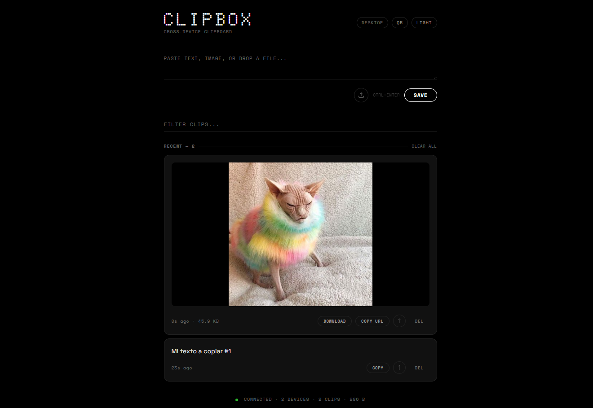
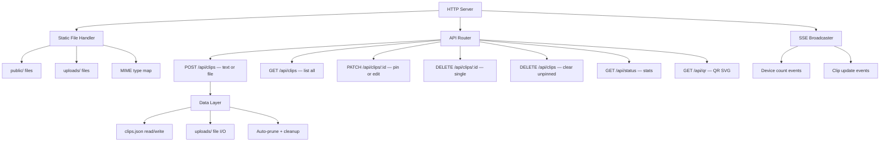
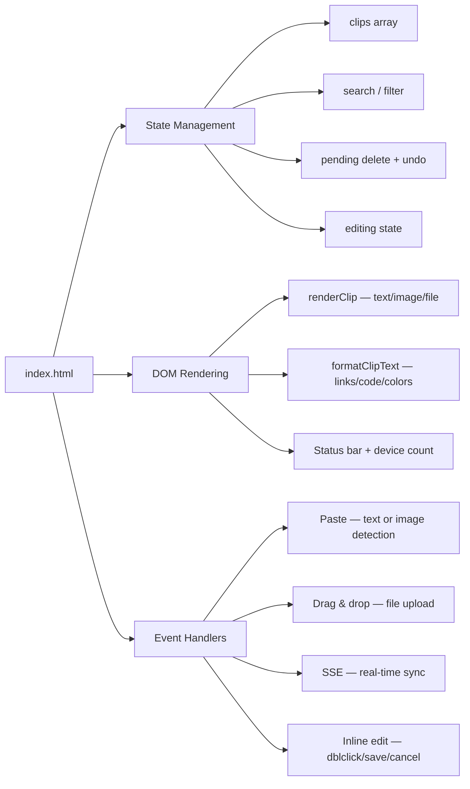
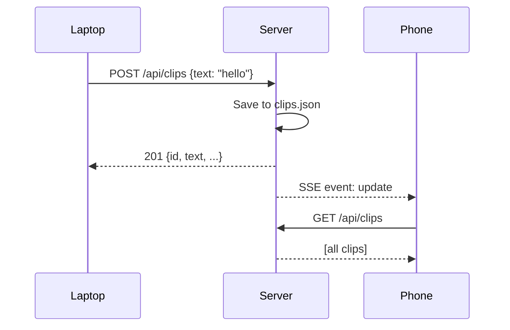

<p align="center">
  
</p>

<h1 align="center">C L I P B O X</h1>

<p align="center">
  <strong>Cross-device clipboard for your local network.</strong><br/>
  Paste text, screenshots, or files on one device — grab them from another.<br/>
  Zero dependencies. Zero accounts. Zero config.
</p>

<p align="center">
  
  
  
  
</p>

<br/>

<p align="center">
  
</p>

---

## Why ClipBox?

You screenshot something on your laptop. You need it on your phone. You paste a code snippet at work. You want it at home. You drag a PDF from your desktop. You need to download it on your tablet.

ClipBox is the fastest path between any two devices on the same network. No cloud. No login. No install. Just `node server.js`.

---

## Quick Start

```bash
git clone <repo-url> clipbox
cd clipbox
node server.js
```

```
  ┌──────────────────────────────────────┐
  │           C L I P B O X              │
  ├──────────────────────────────────────┤
  │  Local:   http://localhost:3377      │
  │  Network: http://192.168.1.42:3377  │
  └──────────────────────────────────────┘
```

Open the **Network URL** on any device connected to the same WiFi. Or tap **QR** in the header and scan with your phone.

---

## Features

### Core

| Feature | Description |
|---------|-------------|
| **Real-time sync** | SSE pushes every change to all connected devices instantly |
| **Image transfer** | Paste a screenshot or photo — it appears on all devices with inline thumbnail |
| **File transfer** | Drag & drop or upload any file up to 10MB — download it from any device |
| **Text clips** | Paste or type text — auto-saved, searchable, with code block detection |
| **Inline edit** | Double-click any text clip to edit in place |
| **Pin clips** | Pin important items to keep them at the top across sessions |
| **Search** | Instant filtering across text content and filenames |
| **Undo delete** | 3-second undo window after deleting any clip |

### UX

| Feature | Description |
|---------|-------------|
| **QR Quick Connect** | Server-generated QR code SVG — scan to connect from mobile in 1 second |
| **Dark / Light mode** | Toggle in the header, persisted in localStorage |
| **Paste-and-go** | Pasting into an empty input auto-saves the clip |
| **Duplicate detection** | Re-pasting the same text moves it to the top instead of creating a duplicate |
| **Image lightbox** | Click any image thumbnail to view full-size with backdrop blur |
| **Color swatches** | `#hex` and `rgb()` values render an inline color preview dot |
| **URL enrichment** | Links are auto-detected with a subtle domain label |
| **Code blocks** | Triple-backtick fences render as styled code blocks |
| **PWA installable** | Add to home screen on mobile for a standalone app experience |

### Technical

| Feature | Description |
|---------|-------------|
| **Zero dependencies** | Only Node.js built-in modules: `http`, `fs`, `path`, `os` |
| **Single-file SPA** | The entire frontend is one HTML file — CSS, JS, markup |
| **Persistent storage** | Clips in `data/clips.json`, files in `data/uploads/` |
| **Auto-prune** | Oldest unpinned clips are automatically removed when exceeding 100 clips |
| **File cleanup** | Physical files are deleted when their clip is deleted, pruned, or cleared |
| **Directory traversal protection** | Static file serving validates paths against the public root |
| **CORS enabled** | All API endpoints return `Access-Control-Allow-Origin: *` |

---

## Architecture

```
clipbox/
├── server.js              # HTTP server — API, static files, SSE, QR, uploads
├── public/
│   ├── index.html         # Single-file SPA (HTML + CSS + JS)
│   └── manifest.json      # PWA manifest for home screen install
├── data/                  # Auto-created at startup
│   ├── clips.json         # Persisted clip metadata
│   └── uploads/           # Uploaded files stored by clip ID
├── docs/
│   └── screenshot.png     # Project screenshot
├── package.json
└── README.md
```

### Server Module Map



### Frontend Architecture



---

## API Reference

### `GET /api/clips`

Returns all clips ordered by creation time (newest first).

```bash
curl http://localhost:3377/api/clips
```

```json
[
  {
    "id": "m4x7k2ab",
    "type": "text",
    "text": "Hello from my laptop",
    "pinned": false,
    "createdAt": 1714000000000
  }
]
```

### `POST /api/clips`

Create a new clip. Accepts either text or file payloads.

**Text clip:**

```bash
curl -X POST http://localhost:3377/api/clips \
  -H "Content-Type: application/json" \
  -d '{"text": "Hello from curl"}'
```

**File upload (base64):**

```bash
curl -X POST http://localhost:3377/api/clips \
  -H "Content-Type: application/json" \
  -d '{
    "file": {
      "data": "<base64-encoded-content>",
      "name": "screenshot.png",
      "mime": "image/png"
    }
  }'
```

| Response | Condition |
|----------|-----------|
| `201` | Clip created successfully |
| `200` | Duplicate text detected — moved to top (`{ ...clip, duplicate: true }`) |
| `400` | Missing text, file too large (>10MB), or body too large (>15MB) |

### `PATCH /api/clips/:id`

Toggle pin (no body) or edit text (with body).

```bash
# Toggle pin
curl -X PATCH http://localhost:3377/api/clips/m4x7k2ab

# Edit text
curl -X PATCH http://localhost:3377/api/clips/m4x7k2ab \
  -H "Content-Type: application/json" \
  -d '{"text": "Updated content"}'
```

### `DELETE /api/clips/:id`

Delete a single clip. Returns the deleted clip for potential undo operations.

```bash
curl -X DELETE http://localhost:3377/api/clips/m4x7k2ab
```

```json
{ "ok": true, "clip": { "id": "m4x7k2ab", "type": "text", "text": "...", ... } }
```

### `DELETE /api/clips`

Clear all unpinned clips. Pinned clips are preserved.

```bash
curl -X DELETE http://localhost:3377/api/clips
```

```json
{ "ok": true, "removed": 5 }
```

### `GET /api/events`

Server-Sent Events stream. Used by the frontend for real-time sync.

| Event | Payload | Trigger |
|-------|---------|---------|
| `update` | `{ action: 'add' \| 'delete' \| 'patch' \| 'clear' \| 'duplicate', ... }` | Any clip mutation |
| `devices` | `{ count: number }` | Client connects/disconnects |

### `GET /api/status`

Server stats snapshot.

```json
{ "devices": 2, "clipCount": 15, "storageBytes": 142857 }
```

### `GET /api/qr`

Returns an SVG QR code encoding the server's network URL.

```bash
curl http://localhost:3377/api/qr -o qr.svg
```

### `GET /uploads/:filename`

Serves uploaded files with correct `Content-Type` headers and 24-hour cache.

---

## Data Schema

### Clip Object

```typescript
interface Clip {
  id: string;               // Base36 timestamp + random suffix
  type: 'text' | 'image' | 'file';
  text?: string;            // Present for type: 'text'
  file?: {
    name: string;           // Original filename
    size: number;           // Size in bytes
    mime: string;           // MIME type (e.g., 'image/png')
    stored: string;         // Filename in data/uploads/ (id + extension)
  };
  pinned: boolean;
  createdAt: number;        // Unix timestamp (ms)
}
```

### Storage Layout

```
data/
├── clips.json                    # Array of Clip objects, pretty-printed
└── uploads/
    ├── m4x7k2ab.png             # Stored by clip ID + original extension
    ├── m4x8b3cd.pdf
    └── m4x9d4ef.jpg
```

---

## Configuration

All configuration is via constants at the top of `server.js`:

| Constant | Default | Description |
|----------|---------|-------------|
| `PORT` | `3377` | Server port. Override with `PORT=8080 node server.js` |
| `MAX_CLIPS` | `100` | Maximum clips before auto-pruning oldest unpinned |
| `MAX_FILE_BYTES` | `10 MB` | Maximum file size per upload |
| `MAX_BODY_BYTES` | `15 MB` | Maximum HTTP body size (accounts for base64 overhead) |
| `DATA_DIR` | `./data` | Directory for clips.json and uploads |

---

## How It Works

### Real-Time Sync (SSE)



Every mutation (add, delete, pin, edit, clear) triggers an SSE broadcast. All connected clients re-fetch the full clip list, ensuring consistency.

### File Upload Flow

```mermaid
sequenceDiagram
    participant Browser
    participant Server
    participant Disk

    Browser->>Browser: FileReader.readAsDataURL()
    Browser->>Browser: Strip "data:mime;base64," prefix
    Browser->>Server: POST /api/clips {file: {data, name, mime}}
    Server->>Server: Buffer.from(data, 'base64')
    Server->>Server: Validate size ≤ 10MB
    Server->>Disk: Write to data/uploads/{id}.{ext}
    Server->>Disk: Append clip metadata to clips.json
    Server-->>Browser: 201 {id, type, file: {...}}
    Server-->>All: SSE broadcast
```

### QR Code Generation

The server includes a **zero-dependency QR code encoder** that generates SVG directly. It implements:

- **Byte mode** encoding for URL payloads
- **Reed-Solomon** error correction (GF(256) with polynomial 0x11D)
- **BCH** encoding for format and version information
- **Masking** with all 8 QR mask patterns, selecting the lowest penalty
- Supports QR **versions 1–7** (up to 154 bytes — more than enough for local URLs)

The generated SVG uses `shape-rendering="crispEdges"` for pixel-perfect rendering at any scale.

---

## Client Capabilities

### Input Methods

| Method | Trigger | Clip Type |
|--------|---------|-----------|
| **Type + Save** | Type text, click SAVE or Ctrl+Enter | `text` |
| **Paste text** | Ctrl+V into empty textarea | `text` (auto-saved) |
| **Paste image** | Ctrl+V a screenshot / copied image | `image` (auto-uploaded) |
| **Drag & drop** | Drag any file onto the input area | `image` or `file` |
| **Upload button** | Click the upload icon (essential for mobile) | `image` or `file` |

### Content Rendering

| Pattern | Rendering |
|---------|-----------|
| `https://example.com` | Clickable link + `example.com` domain label |
| `` ```code``` `` | Styled monospace code block |
| `#FF5733` | Inline color swatch dot + hex text |
| `rgb(255, 87, 51)` | Inline color swatch dot + rgb text |
| Long text (>300 chars or >5 lines) | Truncated with [EXPAND] toggle |

### Keyboard Shortcuts

| Shortcut | Context | Action |
|----------|---------|--------|
| `Ctrl+Enter` | Main textarea | Save clip |
| `Ctrl+Enter` | Inline edit | Save edit |
| `Escape` | Inline edit | Cancel edit |
| `Escape` | Dialog open | Close dialog |

---

## Mobile Support

ClipBox is designed mobile-first:

- **Responsive layout** — optimized for screens down to 320px
- **Upload button** — file picker for devices without drag & drop
- **PWA manifest** — installable on home screen (standalone display)
- **QR code** — scan to connect without typing URLs
- **Touch-friendly** — large tap targets, no hover-dependent UI
- **Clipboard fallback** — `document.execCommand('copy')` for non-HTTPS contexts

### Install as App

1. Open ClipBox on your phone
2. Tap "Add to Home Screen" (Safari) or "Install App" (Chrome)
3. ClipBox opens as a standalone app — no browser chrome

---

## Network & Security

### Assumptions

ClipBox is designed for **trusted local networks** (home WiFi, office LAN). It does not implement:

- Authentication or authorization
- HTTPS/TLS encryption
- Rate limiting
- Input sanitization beyond HTML escaping

### Protections

- **Directory traversal prevention** — static file paths are validated against `PUBLIC_DIR`
- **CORS headers** — `Access-Control-Allow-Origin: *` for cross-origin access
- **Body size limits** — 15MB cap prevents memory exhaustion
- **File size limits** — 10MB cap per upload
- **HTML escaping** — all user text is escaped before rendering

> **Note:** Do not expose ClipBox to the public internet without adding authentication.

---

## MIME Type Support

The server includes a built-in MIME type map for serving files with correct `Content-Type` headers:

| Category | Extensions |
|----------|------------|
| **Web** | `.html`, `.css`, `.js`, `.json`, `.xml`, `.webmanifest` |
| **Images** | `.png`, `.jpg`, `.jpeg`, `.gif`, `.webp`, `.svg`, `.ico` |
| **Documents** | `.pdf`, `.txt`, `.zip` |
| **Media** | `.mp4`, `.webm`, `.mp3` |
| **Fonts** | `.woff2`, `.woff`, `.ttf` |

Unknown extensions default to `application/octet-stream`.

---

## Development

### Project Stats

| Metric | Value |
|--------|-------|
| Total LOC | ~2,400 |
| Server | ~840 lines (Node.js) |
| Frontend | ~1,550 lines (HTML + CSS + JS) |
| Dependencies | 0 |
| Node.js built-ins used | `http`, `fs`, `path`, `os` |
| API endpoints | 8 |
| Clip types | 3 (`text`, `image`, `file`) |

### File Responsibilities

| File | Lines | Role |
|------|-------|------|
| `server.js` | ~840 | HTTP server, REST API, SSE broadcasting, file I/O, QR encoder, Reed-Solomon, static serving |
| `public/index.html` | ~1,550 | UI rendering, state management, event handling, file upload, theming, content formatting |
| `public/manifest.json` | 15 | PWA configuration |

### Running on a Different Port

```bash
PORT=8080 node server.js
```

### Data Reset

```bash
rm -rf data/
node server.js
# Fresh start — data/ and data/uploads/ are recreated automatically
```

---

## Troubleshooting

| Problem | Solution |
|---------|----------|
| `EADDRINUSE: address already in use` | Another process is using port 3377. Kill it or use `PORT=XXXX` |
| File upload returns `Text required` | The server needs to be restarted to pick up the latest code |
| QR code not scanning | Ensure your phone is on the same WiFi network as the server |
| Clipboard copy fails | Non-HTTPS contexts may block `navigator.clipboard`. ClipBox uses a fallback, but some browsers restrict it |
| Images not loading on other devices | Verify the other device can reach the server's network IP (not `localhost`) |
| File too large error | Maximum file size is 10MB. Compress or split larger files |

---

## License

MIT

---

<p align="center">
  <sub>Built with nothing but Node.js and a textarea.</sub>
</p>
